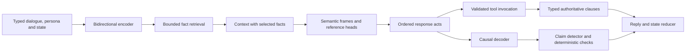

# Contextual Fishbrain model

## Architecture

| Component | Production configuration |
|---|---:|
| Encoder layers | 4, bidirectional self-attention |
| Decoder layers | 2, causal self-attention plus cross-attention |
| Width | 256 |
| Attention heads | 8 |
| Feed-forward width | 1,024 |
| Input limit | 512 tokens |
| Output limit | 64 tokens and 256 characters |
| Selected facts | Up to 8 |
| Semantic frames / response acts | Up to 3 each |
| Agenda | Up to 4 entries |
| Tool invocations per reply | At most 1 |
| Stored parameters | Packed float32 |

The audited development vocabulary produces about 21 million parameters. Vocabulary
changes alter that count. Layer blocks use residual connections, RMS normalization,
and ReLU feed-forward layers. Scalar/reference and SIMD float32 operations share
the same differentiation graph. The decoder caches key/value projections per reply.

## Input and ownership

`StructuredInput` is shared by training and inference. Segment embeddings encode
player/NPC roles, persona, state, approved/session facts, agenda and capabilities.
Boundary tokens separate typed sections. Literal PLAYER or NPC words never define
a role. Token-source metadata preserves utterance sequence and normalized offsets,
including character fallback tokens.

Packing reserves the complete persona and required state plus the current utterance.
It selects bounded facts, retains whole recent utterances, and fits older topic
summaries when space remains. Oversized mandatory input is rejected. No part of the
current utterance is silently cut.

Facts retain subject, predicate, polarity, source sequence, confidence and provenance.
The retrieval query is computed before adding selected facts during both training and
inference. The model scores all bounded profile/session entries against a NONE entry
and selects at most eight. A second encoder pass runs when selected memory changes
the input.

## Understanding and planning

Task-specific learned attention pooling feeds multilabel and exclusive heads.
Contextual token states feed BIO slot labels and fact spans. An utterance pointer
predicts references. Three conditioned frame queries predict speech act, participants,
tool, modality, and span boundaries. Three conditioned planner queries predict
ordered response acts and their frame references.

All supervised understanding losses propagate into encoder weights. Missing labels
remain masked. Frame and plan teacher targets are used during training; runtime
uses predictions. Each frame has its own antecedent pointer. Agenda updates currently
use one learned transition per turn, applied to a bounded collection of four entries.

Plans propose actions; validation controls execution. The runtime checks modality,
speaker, sentence-level vetoes, plan/frame association, registered schema, arguments,
and calibrated confidence. It invokes at most one tool and retains additional actions.
Pending confirmations require an explicit learned confirmation/acceptance frame and a
matching source reference. Ambiguous or incomplete proposals cannot execute.

## Realization

The causal decoder cross-attends to contextual encoder, frame, and plan states.
Social text is generated independently of typed tool/persona clauses. A trained
claim classifier and deterministic screening can reject it; neither is an absolute
factual guarantee. Fallbacks depend on the selected response acts and preserve
attribution for recalled facts.

A generated question requires a clarification act or a follow-up tied to a known
subject/active agenda. During final polishing, only decoder parameters update.
Rejected candidate outputs identified by deterministic screening join authored
negative examples for claim training during the joint understanding phase.

## Data and optimization

The corpus contains 100,000 rows: all original source quotas plus four project-owned
5,000-row groups for action modality, contextual memory, compound plans, and agenda.
Existing authored single-act annotations also supply frame/plan targets. External
rows do not receive invented contextual supervision.

Family/conversation split isolation and held-out input exclusion are audited.
The additional groups are template-generated and do not by themselves establish
generalization to unseen conversational structures.

| Phase | Updates | Learning rate |
|---|---:|---:|
| Masked-language encoder pretraining | 40,000 | Peak 0.0003 |
| Joint understanding/realization, 7:3 updates | 180,000 | Peak 0.0003 |
| Decoder-only polishing | 40,000 | Peak 0.0001 |

Training uses seed 42, effective batch 32 with sequential microbatches, AdamW,
global norm clipping at 1, and phase-local warmup/cosine schedules. The sampler
deterministically permutes semantic families and rotates family members. Complete
optimizer, update counters, next phase, sampler identity and RNG state are saved.

Every 5,000 updates, calibration and scoring use disjoint validation families.
A candidate is retained only when automated gates pass and its operational score
improves. Human and packaging gates remain separate.

## Artifact and release contract

The binary checkpoint binds architecture, config, token order, label/schema and
domain fingerprints, corpus hash, execution thresholds and float32 tensors through
an integrity digest. Training checkpoints also hold optimizer state. Inference
loading allocates neither gradients nor Adam moments. Export cannot relabel a
checkpoint with another corpus hash.

Existing operational thresholds remain, except catalog top-1/top-3 and variation
retrieval metrics, which are explicitly retired for free generation. New gates
require frame/plan exact accuracy of at least 90%, memory/correction accuracy of
at least 95%, and zero unintended tool invocations or altered authoritative fields.
The evaluator also requires 95% exact agenda-state accuracy.

Resource measurements report cold loading, short and long context, allocations,
active resident memory, forced 64-token decoding and concurrent calls separately.
Ablations compare identical test splits using paired semantic-family bootstrap
intervals. No full trained candidate or quality claim has been released.
