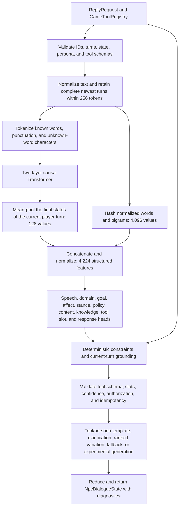

# Fishbrain AI model structure

This document describes the model stored in `data/models/model-latest.fbm` and the
runtime path that uses it. It distinguishes learned tensor inputs from caller-owned
state, persona, and game tools. Those values all affect a reply, but they do not all
enter the neural network as numeric features.

## Current artifact

| Property | Value |
|---|---:|
| Transformer layers | 2 |
| Token embedding width | 128 |
| Attention heads per layer | 8 |
| Dimensions per attention head | 16 |
| Feed-forward width | 256 |
| Maximum context | 256 tokens |
| Attention window | 256 tokens |
| Position-embedding period | 256 |
| Maximum experimental output | 64 tokens |
| Known input words | 52,767 |
| Input token IDs | 52,880 |
| Output words | 11,860 |
| Output token IDs | 11,973 |
| Transformer parameters | 8,599,552 |
| Structured-head input features | 4,224 |
| Structured-head parameters | 1,448,832 |
| Completed training steps | 210,000 |

The input-token total is 113 control, punctuation, and unknown-word character tokens
plus 52,767 known words. The output vocabulary contains the same 113 base tokens plus
11,860 words that occur in supervised output fields.

## Inputs to one reply

The public `ReplyRequest` contains seven fields, and `Brain.Reply` receives a tool
registry as a separate eighth runtime input:

| Runtime input | Purpose | Learned tensor input? |
|---|---|:---:|
| Conversation ID | Idempotency and diagnostics | No |
| Turn ID | Idempotency and diagnostics | No |
| Structured dialogue turns | Current and recent player/NPC text | Yes |
| `NpcDialogueState` | Rapport, trust, hostility, topics, pending work, and references | No |
| `NpcPersona` | Authoritative identity and authored character facts | No |
| Seed | Deterministic response variation | No |
| Response mode | Ranked production output or experimental generation | No |
| `GameToolRegistry` | Available capabilities, authorization, facts, and mutations | No |

The neural encoder therefore does not have a fixed set of eight scalar inputs. Its
direct input is a variable-length sequence of 1 to 256 token IDs. State, persona, and
tools are validated and applied by deterministic runtime logic before and after learned
classification.

## End-to-end reply flow



## Text normalization and tokenization

Input is normalized to uppercase. Repeated whitespace is collapsed and punctuation is
canonicalized. Supported visible characters are `A-Z`, `0-9`, whitespace, `. , ? ! ' - :`.

Known words use one token each. An unknown word does not become one shared unknown token.
It is encoded as:

```text
WORD_BEGIN, uppercase character/digit/apostrophe/hyphen tokens, WORD_END
```

This preserves an unseen name such as `QETH-9` for slot extraction and tool arguments.
Each retained dialogue turn is prefixed in text with `PLAYER` or `NPC`. The context packer
removes only complete oldest turns. It always retains the current player turn or rejects
it if that turn alone exceeds 256 tokens.

## Transformer input layer

For every sequence position, the model adds two learned 128-value vectors:

1. the embedding for the token ID;
2. the embedding for the position modulo 256.

For a sequence of `T` tokens, this produces a `T x 128` hidden-state matrix. The current
artifact has 52,880 possible input token IDs, so the token-embedding table contains
6,768,640 parameters. The position table contains 32,768 parameters.

## Transformer layer 1

The first layer receives the token-plus-position matrix and performs:

1. RMS normalization of each 128-value token state;
2. separate 128-by-128 query, key, and value projections;
3. causal self-attention with eight 16-value heads;
4. a 128-by-128 attention-output projection;
5. a residual connection from the layer input;
6. RMS normalization;
7. a 128-to-256 feed-forward projection;
8. ReLU activation;
9. a 256-to-128 projection and second residual connection;
10. final RMS normalization.

Causal attention means a position can attend only to itself and earlier positions. With
the current 256-token attention window, every retained earlier token is visible.

## Transformer layer 2

The second layer has its own query, key, value, attention-output, and feed-forward
weights. It repeats the same operations on layer 1's output. The layers do not share
parameters. Each layer has 131,072 parameters; together they contain 262,144.

## Context representation

The structured path does not use only the final token. It averages the 128-value final
layer states that correspond to the current player turn. This produces the contextual
vector used by the structured heads.

The legacy perception path uses the final hidden state after a sequence framed as
`BOS, current player text, SEP`. Its three outputs are:

| Head | Classes | Activation |
|---|---:|---|
| Broad dialogue intent | 20 | Softmax |
| User affect | 5 | Softmax |
| Response expected | 2 | Softmax |

These heads account for 3,456 Transformer parameters.

## Structured feature layer

The main production perception model receives 4,224 normalized features:

| Feature block | Width | Contents |
|---|---:|---|
| Lexical block | 4,096 | Bias plus stable hashes of normalized words and adjacent word pairs |
| Context block | 128 | Mean-pooled current-turn Transformer representation |

Hash collisions are possible because arbitrary words and bigrams share 4,095 non-bias
buckets. The contextual block supplies word-order and dialogue-history information that
the lexical hashes cannot represent.

Slot tagging uses a separate per-word 4,224-value feature vector. It hashes the word,
its first three characters, the previous two words, the next two words, and local word
combinations. The slot path does not use the 128-value Transformer context block.

## Structured output heads

Every structured head is a linear projection from 4,224 features. Multi-label heads use
independent sigmoid scores and calibrated per-label thresholds. Exclusive heads use
softmax. The current model has 343 output rows across these heads:

| Head | Output rows | Type | Meaning |
|---|---:|---|---|
| Speech acts | 18 | Multi-label sigmoid | Ask, request, warn, apologize, and related acts |
| Domains | 20 | Multi-label sigmoid | Social, trade, combat, technology, and other topics |
| Goals | 24 | Multi-label sigmoid | Rapport, information, transaction, travel, and other goals |
| Affect | 5 | Softmax | Neutral, friendly, distressed, frustrated, or hostile |
| Stance | 5 | Softmax | Friendly, neutral, cautious, hostile, or deceptive |
| Response policy | 8 | Softmax | Answer, clarify, execute, refuse, silence, acknowledge, negotiate, or defer |
| Content flags | 9 | Multi-label sigmoid | Profanity and separate sensitive-content categories |
| BIO slots | 29 | Per-word softmax | Outside plus beginning/inside for 14 slot types |
| Knowledge target | 14 | Softmax | Persona, capability, inventory, location, or world-fact target |
| Tool | 10 | Softmax | `NONE` plus nine demo tool schemas; diagnostic until validated |
| Response plan | 201 | Softmax and pairwise ranking | Production response-plan candidate |

The 343 rows multiplied by 4,224 features produce 1,448,832 parameters.

## Language output head

The optional generated-text path projects each 128-value Transformer state into 11,973
output-token logits. The output head contains 1,532,544 parameters. Generation samples
at most 64 tokens and permits only visible text outputs. Production defaults to ranked
responses and does not use free generation for authoritative tool results.

## Deterministic runtime layer

Learned outputs are proposals, not authority. The runtime:

- extracts and preserves exact slot text from the current turn;
- applies reviewed current-turn, safety, hostility, clarification, and domain constraints;
- resolves bounded references and pending actions from `NpcDialogueState`;
- derives persona answers only from `NpcPersona`;
- selects a tool only after deterministic schema, argument, capability, and confidence checks;
- permits at most one tool invocation per reply;
- renders exact facts and mutations through validated templates;
- updates dialogue state through the deterministic reducer;
- returns both raw and constrained perception in diagnostics.

This separation is why an output can be conversational while inventory counts, prices,
locations, and mutations remain exact.

## How training data is fed into the model

The corpus compiler writes contextual JSONL records. A row can carry full turns, initial
state, persona, structured targets, slots, a tool schema and arguments, a positive
response plan, rejected alternatives, response text, and provenance. Complete
conversations and connected semantic families stay in one data split.

Training uses three paths:

1. **Contextual structured training.** Dialogue text is packed and encoded. The
   Transformer supplies the 128-value current-turn context; lexical hashes supply the
   other 4,096 features. Supervised heads update only when the row declares them.
2. **Response ranking.** The correct response plan is trained against the strongest
   incorrect plan with a pairwise logistic objective.
3. **Language and legacy perception training.** Token streams contain control markers
   for beginning, separator, state, decision, tool call, tool result, text, and end.
   Next-token cross-entropy trains language/tool serialization; separate softmax losses
   train broad intent, affect, and whether a response is expected.

Long language streams are divided into samples with up to 96 conditioning tokens and 32
target tokens. Their combined training sample is at most 128 tokens even though runtime
inference supports a 256-token context.

## Training schedule

The current artifact completed 210,000 deterministic updates:

| Steps | Training behavior |
|---|---|
| 0-160,000 | Interleave seven structured updates, two response-ranking updates, and one language-generation update per ten steps |
| 160,000-200,000 | Freeze the Transformer and polish structured/ranking heads with rare-domain, explicit-tool, hard-negative, general-response, and slot sampling |
| 200,000-210,000 | Freeze the Transformer and every passing structured head; train only response-plan classification and ranking |

Training uses Adam with learning rate `0.005`, beta 1 `0.85`, beta 2 `0.99`, epsilon
`1e-8`, and deterministic seed `42`. Checkpoints preserve model tensors, optimizer state,
sampler position, vocabulary, calibration, and random state so resume is bit-equivalent.

## Current limitation

This structure has been evaluated primarily for bounded game dialogue, structured
perception, tools, and catalog ranking. It has not passed the general-purpose banter and
small-talk gate defined in `INFO.md` and `docs/MODEL_EVALUATION.md`. The 201-plan catalog
and optional language head describe the current implementation; they are not evidence
that broad social conversation is already solved.
