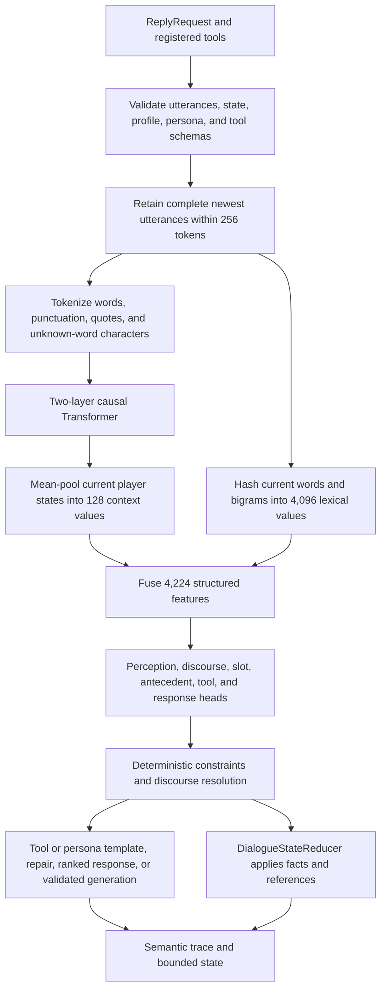

# Fishbrain AI model structure

This document describes the current, unversioned model schema and the runtime that
uses it. Fishbrain does not load older schemas. `data/models/model-latest.fbm` is
replaced only after a freshly trained candidate passes every release gate.

## Shape

| Property | Value |
|---|---:|
| Transformer layers | 2 |
| Token embedding width | 128 |
| Attention heads per layer | 8 |
| Dimensions per attention head | 16 |
| Feed-forward width | 256 |
| Maximum runtime context | 256 tokens |
| Position-embedding period | 256 |
| Maximum generated response | 64 tokens |
| Known input words | Artifact-dependent; recorded after release |
| Input token IDs | Known input words plus 114 base IDs |
| Output words | Artifact-dependent; recorded after release |
| Output token IDs | Known output words plus 114 base IDs |
| Sequence-model parameters | Artifact-dependent because embedding rows follow the vocabulary |
| Lexical hash features | 4,096 |
| Context features supplied to structured heads | 128 |
| Structured feature width | 4,224 |
| Structured output rows | 371 |
| Structured-head parameters | 1,567,104 |
| Planned fresh training | 260,000 fixed steps |

Vocabulary sizes are stored in the artifact and depend on the audited corpus. The
base tokenizer has 114 control, punctuation, and unknown-word character IDs. Known
input and output words are appended to that base. The tokenizer accepts double quotes
so reported speech can remain visible to the discourse model.

## Inputs to a reply

`ReplyRequest` has nine fields. `Brain.Reply` receives the tool registry separately:

| Input | Owner and use | Neural text input? |
|---|---|:---:|
| Conversation ID | Caller; idempotency and diagnostics | No |
| Turn ID | Caller; idempotency and diagnostics | No |
| `DialogueUtterance` list | Caller; speaker, sequence, and text history | Yes |
| `NpcDialogueState` | Fishbrain-reduced bounded session memory | Packed for conversation generation |
| `NpcPersona` | Caller-authored NPC facts | Packed for conversation generation |
| `PlayerConversationProfile` | Caller-approved persistent player facts | Packed for conversation generation |
| Response sequence | Caller-reserved sequence for the new NPC utterance and trace | No |
| Seed | Caller; deterministic selection | No |
| Response mode | Production hybrid or deterministic-only | No |
| `GameToolRegistry` | Caller authorization and authoritative game facts | No |

The main contextual classifier receives a variable sequence of 1 to 256 token IDs.
The conversational realization path receives a separate packed sequence containing
persona, approved profile facts, session facts, the resolved discourse frame, its
antecedent, and up to six retained earlier utterances.

An utterance is one complete message by one speaker. It is not one word or necessarily
one sentence. Sequence numbers are conversation-local, unique, and strictly increasing.

## Reply flow

## Token and embedding layer

Input is normalized to uppercase. Supported visible characters are letters, digits,
whitespace, `. , ? ! ' " - :`. Known words use one token. An unknown word is encoded
as `WORD_BEGIN`, its uppercase character/digit/apostrophe/hyphen tokens, and
`WORD_END`. This preserves unseen names and tool arguments.

Each sequence position adds a learned 128-value token embedding to a learned 128-value
position embedding. For `T` tokens the result is a `T x 128` matrix.

## Transformer layer 1

The first layer performs:

1. RMS normalization;
2. independent 128-by-128 query, key, and value projections;
3. causal self-attention with eight 16-value heads;
4. a 128-by-128 attention output projection and residual connection;
5. RMS normalization;
6. a 128-to-256 projection, ReLU, and 256-to-128 projection;
7. a second residual connection and final RMS normalization.

## Transformer layer 2

The second layer repeats the same operations with separate weights. The layers do not
share parameters. Causal attention can use only the current and earlier positions.

## Structured feature layer

The final Transformer states for the current player utterance are averaged into 128
values. These are concatenated with 4,096 stable hashes of normalized words and
adjacent word pairs.

Slot tagging builds a separate 4,224-value vector per current-turn word. It includes
the word, its prefix, nearby words, and local combinations. Fact values use a separate
three-class `O/B/I` head. They never share parameters with game and tool slots.

## Learned heads

All structured heads are linear projections from 4,224 features. Multi-label heads use
sigmoid/BCE with calibrated thresholds. Exclusive heads use softmax cross-entropy.

| Head | Rows | Purpose |
|---|---:|---|
| Speech acts | 18 | Ask, inform, correct, thank, threaten, and related acts |
| Domains | 20 | Social and game topic labels |
| Goals | 24 | Rapport, information, transaction, task, and other goals |
| Affect | 5 | Player affect |
| Stance | 5 | Friendly through hostile/deceptive stance |
| Response policy | 8 | Answer, clarify, tool, refuse, silence, acknowledge, negotiate, defer |
| Content flags | 9 | Safety-sensitive content bands |
| BIO slots | 27 | Outside plus beginning/inside for 13 game and tool slot types |
| Knowledge target | 14 | Persona, capability, inventory, location, or world target |
| Discourse act | 6 | None, inform, correct, reject, explain, or refer back |
| Discourse subject | 3 | Player, NPC, or none |
| Discourse target | 3 | Player, NPC, or none |
| Fact predicate | 12 | None plus 11 conversational fact kinds |
| Fact polarity | 2 | Positive or negative |
| Fact-value BIO | 3 | Outside, beginning, or inside a conversational fact value |
| Antecedent pointer | 1 scorer | One softmax across retained utterances and explicit `NONE` |
| Tool | 10 | None plus nine demo tool schemas |
| Response plan | 201 | Ranked catalog plan |

The antecedent head scores up to eight retained utterances plus `NONE` in one normalized
distribution. Its pair features include candidate speaker, distance, lexical overlap,
discourse act, and the shared Transformer context. Ambiguous and evicted references are
trained as `NONE`. Deterministic constraints override the scorer only for unambiguous
cases such as an immediate `WHAT DO YOU MEAN?`.

## Conversational memory

The model proposes a `DiscourseFrame`; it does not mutate memory. Only
`DialogueStateReducer` may apply the frame.

Session memory contains at most 16 unverified facts and eight topic summaries. A fact
stores subject, typed predicate, normalized value, polarity, source utterance,
confidence, and provenance. Name, role, occupation, origin, and home are single-valued:
a newer positive replaces the previous positive, while negation removes only the
matching positive value and retains the negative conversational claim.

`NpcDialogueState.Initial` clears session memory. Fishbrain never writes to the
caller-owned `PlayerConversationProfile`; the host may create a new profile containing
facts it explicitly approves.

Every NPC response also records a semantic trace: response utterance sequence, action,
topic, referenced predicates, plan/frame identifier, and fallback reason. An explanation
response describes this trace and repairs an unsuitable fallback when required.

## Production response hybrid

Priority is:

1. validated game-tool templates;
2. discourse correction, explanation, and repair actions;
3. no-response, clarification, capability, and safety templates;
4. caller-authored persona templates;
5. ranked project-owned responses or conversational generation;
6. a typed deterministic fallback.

Generation is part of `ResponseMode.Production`. `DeterministicOnly` disables it. The
generator cannot render tool results or exact persona facts. Its output is rejected if
it is invalid, overlength, claims an authoritative quantity or mutation, invents a
persona fact, or contradicts the caller persona. Rejected text becomes an uncertainty
fallback and a diagnostic reason.

Player statements such as `I HAVE 1000 GOLD` remain unverified conversation. They can
be acknowledged but cannot change inventory, currency, permissions, quests, locations,
tool arguments, or any other caller-owned field.

## Training rows and data flow

The audited corpus contains 80,000 rows. Each contextual row can store the complete
conversation, initial dialogue state, initial approved profile, persona, discourse
frame, fact delta, antecedent sequence, response action, acceptable constraints,
rejected response, structured targets, tool data, and provenance.

Training has four connected paths:

1. Contextual classification encodes retained utterances and updates the shared
   Transformer plus supervised structured heads.
2. Discourse training updates act, participant, predicate, polarity, fact span, and
   dynamic antecedent heads.
3. Pairwise response ranking trains the correct catalog plan against its strongest
   eligible negative.
4. Language training serializes the separate conversational conditioning pack and
   desired response for next-token cross-entropy. A reviewed rejected response adds
   weight-0.2 unlikelihood loss at its first divergent token.

Complete conversations and semantic families are assigned to one split before
expansion. The operational 256-turn benchmark and the B01-B12 conversation sessions are
excluded from compilation and audited for exact contamination.

## Training schedule

| Steps | Behavior |
|---|---|
| 0-200,000 | 70% structured, 20% ranking, and 10% generation; structured minibatches are 75% operational and 25% discourse |
| 200,000-245,000 | Freeze the Transformer and passing operational heads; use 60% discourse, 25% ranking, and 15% corrective operational updates |
| 245,000-260,000 | Freeze all structured heads and polish conversational realization only |

Structured training uses averaged 32-example minibatches. Discourse selections are
40% facts, 30% references, 20% banter, and 10% hard negatives. Families are shuffled
deterministically per epoch and members rotate deterministically. The structured rate
follows cosine decay from `0.03` to `0.003` by step 200K, and positive-class weights
never exceed `2.0`. Calibration uses one fixed family-balanced 2,000-row subset.

Training starts from deterministic seed 42 and fresh initialization. Checkpoints retain
weights, optimizer state, sampler position, vocabulary, calibration, and random state.
The release artifact is exported only if all operational, discourse, runtime, authority,
and two-reviewer conversation gates pass without lowering a threshold.
